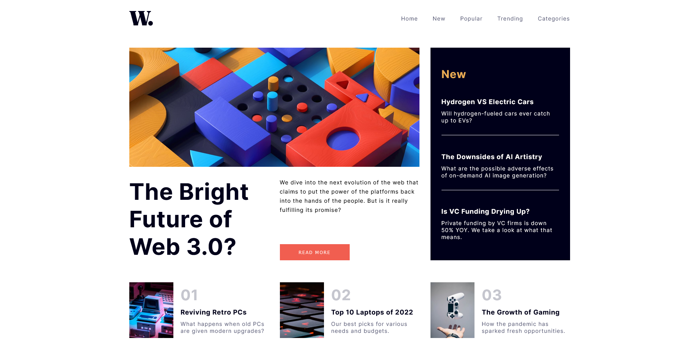

# Frontend Mentor - News homepage solution

This is a solution to the [News homepage challenge on Frontend Mentor](https://www.frontendmentor.io/challenges/news-homepage-H6SWTa1MFl). Frontend Mentor challenges help you improve your coding skills by building realistic projects. 

## Table of contents

- [Overview](#overview)
  - [The challenge](#the-challenge)
  - [Screenshot](#screenshot)
  - [Links](#links)
- [My process](#my-process)
  - [Built with](#built-with)
  - [What I learned](#what-i-learned)
  - [Continued development](#continued-development)
  - [Useful resources](#useful-resources)
- [Author](#author)
- [Acknowledgments](#acknowledgments)

## Overview

### The challenge

Users should be able to:

- View the optimal layout for the interface depending on their device's screen size
- See hover and focus states for all interactive elements on the page
- Create a navigation bar for mobile device screen sizes

### Screenshot

### Links

- Solution URL: [Add solution URL here](https://your-solution-url.com)
- Live Site URL: [Add live site URL here](https://your-live-site-url.com)

## My process

### Built with

- Semantic HTML5 markup
- CSS custom properties
- Flexbox
- CSS Grid

### What I learned

The navigation menu was the greatest challenge for this project. Accessible Rich Internet Applications (ARIA) and CSS properties and values were briefly introduced to complete this navigation menu. Utilising CSS grid for the layout proved a bit challenging as well. Smaller CSS grid and flexbox components as grid items create new challenges regarding alignment of the grid items. However, it also created new posibilities for better CSS grid layout designs.

### Continued development

I am well aware that I still have a long way to go to learn the fundamentals of HTML, CSS and JS. However, being introduced to ARIA, I would like to explore these sets of roles and attributes to create an accessible rich experience for my projects to come.

### Useful resources

- [Example resource 1](https://developer.mozilla.org/en-US/docs/Web/Accessibility/ARIA) - This introduced me to some of the ARIA attributes, which aided with the JS code implemented.

## Author

- Frontend Mentor - [@EJMK18](https://www.frontendmentor.io/profile/EJMK18)
- Twitter - [@EJMK18](https://twitter.com/EJMK18)

## Acknowledgments

Kevin Powell's video Responsive navbar tutorial using HTML CSS & JS (https://www.youtube.com/watch?v=HbBMp6yUXO0&t=2555s) has been extremely helpful in completing this project. 
